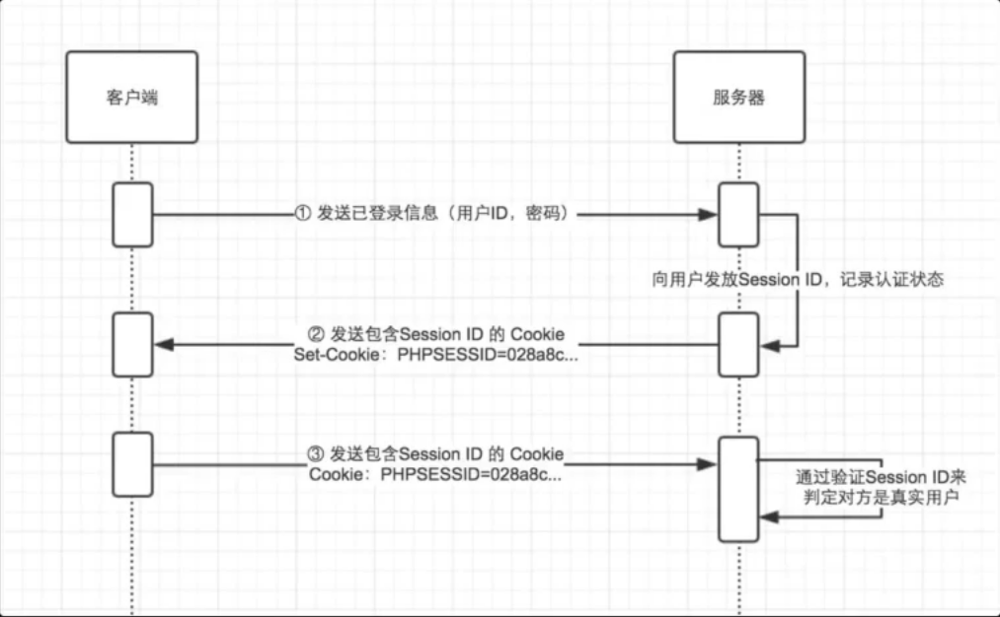

# swag的下载和使用

## swag的下载

```go
go install github.com/swaggo/swag/cmd/swag@latest
//当执行过这个之后，其他的项目就只需要执行下面的两条命令即可

go get -u github.com/swaggo/gin-swagger
go get -u github.com/swaggo/files
```

使用`swag init`可以生成api文档

浏览器访问：`http://ip:hsot/swagger/index.html`

## swag的使用
需要在main函数前面加上这些：
```go
import(
    _ "docs" //或者需要加上一个项目名：_ "项目名/docs"
)

// @title xxx
// @version xxx
// @description xxx
// @host xxx
// @BasePath xxx
func main() {
    
}
```

执行`swag init`之后会出现一个docs的目录

在路由中添加：
```go
r.GET("/swagger/*any", ginSwagger.WrapHandler(swaggerFiles.Handler))
```

在每一个api函数前，同样需要添加一些前缀：
```go
// @tags 标签
// @Summary 标题
// @Description 描述,可以有多个
// Param limit query string false "表示单个参数"
// Param data body request.Request   true "表示多个参数"
// @Router /api/users [post]
// @Produce json
// @Success 200 {object} gin.H{"msg":"成功"}
func xxxView(c *gin.context){
	
}
```

最后，运行项目，在浏览器中输入 **`127.0.0.1:8080/swagger/index.html`** 即可看到API文档。

# 项目的平滑重启
每一次修改完项目代码后都需要手动点击运行，十分麻烦，可以 golang 的 air 库来进行平滑重启。

air 是 Go 语言的热加载工具，它可以监听文件或目录的变化，自动编译，重启程序。大大提高开发期的工作效率。

## air 的下载
使用命令：`go install github.com/cosmtrek/air@latest` (会自动生成 air.exe 文件)

在命令行中输入`air`自动运行表示安装成功。

## air 的使用
在代码修改后，当编译器失去焦点后，便会自动重启。

如果修改某个文件后不需要自动重启项目，我们输入`air init`便会在根目录出现一个 air 的配置文件，只需要在`exculude_dir`中将文件名加入进去即可。


# 用户登陆的 JWT

jwt 全称为 `json web token` ，jwt更像是一种标准。

在 go 中有相应的第三方依赖，使用命令 `go get github.com/dgrijalva/jwt-go/v4` 即可。


# redis 的连接和使用

go 语言使用 redis 需要下载一个第三方依赖：
`go get github.com/go-redis/redis`

# 发送 email

go 语言使用 redis 需要下载一个第三方依赖：
`go get gopkg.in/gomail.v2`

发送email验证的流程为：
1. 首先用户会输入邮箱
2. 后台会给用户发送验证码
3. 用户输入验证码，密码
4. 验证成功，完成绑定

## session

session 的原理：


在 go 中使用 session 同样需要下载一个第三方依赖：
`go get github.com/gin-contrib/sessions`

# 通过IP判断地址
在Go语言中，可以使用第三方库来根据用户的IP地址判断其所在的地理位置。一个常用的库是geoip2-golang，它提供了IP地址解析和地理位置查询的功能。
在 go 中使用 geoip2-golang 同样需要下载一个第三方依赖：
`go get github.com/oschwald/geoip2-golang`


# ES的连接
需要下载第三方依赖：
`go get github.com/olivere/elastic/v7`


# MarkDown 转 Html
这里需要下载第三方依赖：
`go get github.com/yuin/goldmark`  暂时先不用这个

用这个：`go get github.com/russross/blackfriday`

# html 获取文本内容，xss过滤
需要这个依赖：
`go get github.com/PuerkitoBio/goquery`

# 一个结构体想要在不同的接口下返回不同的json数据字段
需要用到第三方库：
`go get github.com/liu-cn/json-filter/filter`